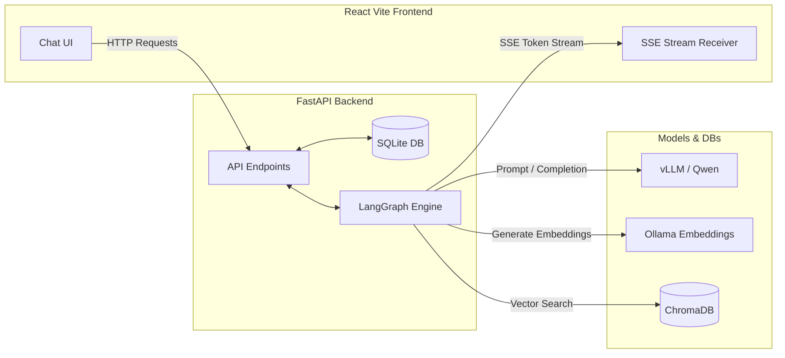

# 🔄 Self-Reflective Agentic RAG

## Project Overview
This project implements an advanced **Agentic Retrieval-Augmented Generation (RAG)** system designed to drastically reduce hallucinations and improve answer quality. Rather than blindly passing retrieved context to an LLM, this system leverages a **Semantic Router** and an intelligent **Self-Reflection Loop** that evaluates, grades, and iteratively refines search queries until the retrieved context is both relevant and sufficient to answer the user's question.

## Key Features
- **Semantic Intent Routing:** Automatically routes queries to specialized sub-graphs based on intent (`CONVERSATIONAL`, `HISTORY`, `DOC_SUMMARY`, `DOC_SPECIFIC`, `OUT_OF_SCOPE`).
- **Self-Reflective Retrieval:** An LLM acts as a strict judge, grading retrieved chunks on Relevance, Sufficiency, and Consistency.
- **Query Rewriting:** If context fails the grading, the system automatically rewrites a better, more specific search query and tries again.
- **Stateful Workflow:** Built with **LangGraph** to manage complex, cyclic agentic workflows.
- **Real-Time Streaming:** Uses **FastAPI & Server-Sent Events (SSE)** to stream the agent's thought processes, retrieved sources, and token-by-token answers to the UI instantly.
- **Persistent Memory:** Fully persistent chat sessions, document tracking, and chat histories backed by **SQLite** and SQLAlchemy.
- **Smart Conversation Titles:** Asynchronously generates concise, contextual conversation titles in the background using the LLM without blocking the chat stream.
- **Modern React Frontend:** A clean, ChatGPT-like interface that visually displays the inner "thought process", reflection logs, and source cards.

## System Architecture

### 1. High-Level Architecture
The system employs a decoupled, asynchronous architecture separating the React frontend from the heavy Python backend.



### 2. Agentic RAG Workflow (LangGraph)

```mermaid
flowchart TD
    User([User Question]) --> Router{Semantic Intent Router}
    
    Router -- CONVERSATIONAL --> GenConv[Generate Conversational Response]
    Router -- HISTORY --> GenHist[Generate from Chat History]
    Router -- OUT_OF_SCOPE --> OutScope[Reject/Out of Scope]
    Router -- DOC_SUMMARY --> DocSum[Generate Summary]
    Router -- DOC_SPECIFIC --> Retrieve[Retrieve Chunks from Chroma]
    
    Retrieve --> Grade{Grade Context (LLM)}
    
    Grade -- VERDICT: NO --> Rewrite[Rewrite Query]
    Rewrite --> Retrieve
    
    Grade -- VERDICT: YES --> Generate[Generate Answer]
    Generate --> Output([Final Streamed Output])
    
    Grade -. MAX ITERATIONS REACHED .-> Generate
    GenConv --> Output
    GenHist --> Output
    OutScope --> Output
    DocSum --> Output
```

## Tech Stack

| Component | Technology | Purpose |
| --- | --- | --- |
| **Backend API** | FastAPI | High-performance asynchronous API, SSE streaming. |
| **Language Model** | vLLM (OpenAI-Compatible) | Complex reasoning, grading context, generating answers, routing. |
| **Embeddings** | Ollama (nomic-embed-text) | Converting text chunks into vector embeddings. |
| **Vector Database** | ChromaDB | Local storage for document vectors. |
| **Relational Database**| SQLite / SQLAlchemy | Storing sessions, messages, documents, and chat history. |
| **Orchestration** | LangGraph | Managing the cyclic agent state and conditional routing. |
| **Document Processing**| LangChain | Loading, splitting, and processing PDFs. |
| **Frontend UI** | React.js | Modern, responsive web interface with real-time markdown streaming. |

## Project Structure

```text
agentic_rag_system/
│
├── src/
│   ├── __init__.py           # Package marker
│   ├── api.py                # FastAPI endpoints, DB sessions, SSE streaming logic
│   ├── config.py             # Global configurations & API handling
│   ├── database.py           # SQLAlchemy setup for SQLite
│   ├── models.py             # Database schemas (Session, Message, Document)
│   ├── state.py              # LangGraph state schema definition
│   ├── document_processor.py # PDF ingestion, chunking, and ChromaDB logic
│   ├── nodes.py              # Core LangGraph agent nodes (retrieve, grade, rewrite, generate)
│   ├── graph.py              # Workflow orchestration and conditional routing
│   └── title_utils.py        # Async LLM-based conversation title generation
│
├── frontend/                 # React application source code
├── data/                     # Persistent SQLite Database storage
├── storage/                  # ChromaDB vector store data
├── requirements.txt          # Python dependencies
├── .env.example              # Environment variables template
├── run.py                    # Main entry point to start the backend API
└── README.md                 # Project documentation
```

## Step-by-Step Execution Flow
1. **Ingestion**: User uploads a PDF. The backend chunks and embeds it into ChromaDB, creating a `Document` record in SQLite.
2. **Querying**: User asks a question via the React UI. The backend receives the question, saves it to SQLite, and updates the title if it's a new conversation.
3. **Routing**: The LLM classifies the intent. If conversational or out of scope, it bypasses retrieval entirely.
4. **Retrieval**: System fetches the top relevant chunks from ChromaDB.
5. **Grading**: The LLM evaluates the chunks against the question.
6. **Decision**:
   - If graded `YES`: The chunks are passed to the generator.
   - If graded `NO`: The LLM provides a refined query, and the system loops back to **Retrieval**.
7. **Streaming Generation**: The LLM formulates a final answer strictly grounded in the validated context, streaming it back to the React UI token-by-token.

## Installation

1. **Clone the repository:**
   ```bash
   git clone https://github.com/Hetgandhi25/agentic-rag-system.git
   cd agentic-rag-system
   ```

2. **Create a virtual environment & install dependencies:**
   ```bash
   python -m venv venv
   source venv/bin/activate  # On Windows: venv\Scripts\activate
   pip install -r requirements.txt
   ```

3. **Install frontend dependencies:**
   ```bash
   cd frontend
   npm install
   cd ..
   ```

## Environment Variables
Create a `.env` file in the root directory (use `.env.example` as a template):

```env
OLLAMA_BASE_URL=http://localhost:11434
OLLAMA_MODEL=qwen3:8b
EMBEDDING_MODEL=nomic-embed-text
MAX_ITERATIONS=3
MODEL_PAI_BASE_URL=http://your-vllm-endpoint/v1
MODEL_PAI_API_KEY=your-api-key
MODEL_PAI_MODEL=qwen3.8-27b
```

## How to Run
Start the backend and frontend simultaneously:

1. **Start the FastAPI Backend:**
   ```bash
   python run.py
   ```
   *The backend will run on `http://127.0.0.1:8000`.*

2. **Start the React Frontend:**
   ```bash
   cd frontend
   npm run dev
   ```
   *The frontend will run on `http://localhost:5173`.*

## Traditional RAG vs Agentic RAG

| Feature | Traditional RAG | Agentic RAG |
| --- | --- | --- |
| **Flow** | Linear (Retrieve -> Generate) | Cyclic (Retrieve <-> Grade -> Generate) |
| **Intent Handling**| None. Searches vectors for everything. | Smart routing (e.g. History vs Doc vs General). |
| **Query Refinement** | None. Fails if user query is poor. | Active. Rewrites query if initial results are bad. |
| **Hallucination Risk** | High. Tries to answer even with bad context. | Low. Explicitly blocks generation until context is validated. |

## Future Improvements
- **Multi-Document Support**: Expand the DB schema and Vector Store metadata to allow querying across entire collections/knowledge bases simultaneously.
- **Web Search Fallback**: Use an agentic tool to fetch web context for `OUT_OF_SCOPE` queries.
- **Inline PDF Viewer**: Render the PDF in the frontend sidebar and visually highlight the exact chunks retrieved during generation.
- **User Authentication**: Implement JWT auth for multi-tenant support.

## Interview Explanation
> *"This project demonstrates my ability to move beyond basic LangChain chains and build stateful, agentic workflows using LangGraph. I recognized that traditional RAG systems suffer from high hallucination rates when retrieval fails. To solve this, I designed a self-reflective loop where the LLM acts as an autonomous agent—grading its own retrieval and rewriting queries dynamically. By structuring the code into distinct modules (state, nodes, graph, UI), I ensured the system is scalable, testable, and production-ready."*

