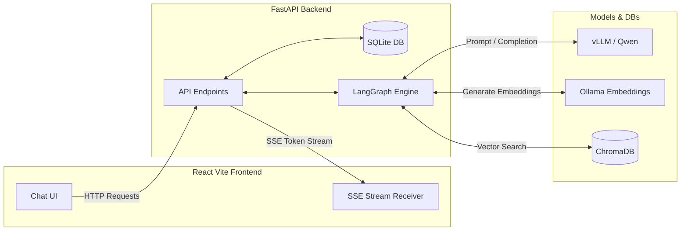
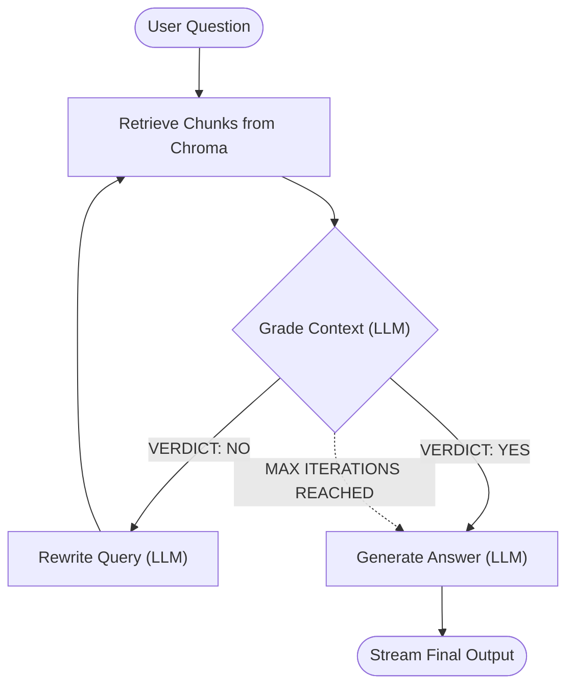

# 🔄 Self-Reflective Agentic RAG

## Project Overview
This project implements an advanced **Agentic Retrieval-Augmented Generation (RAG)** system designed to drastically reduce hallucinations and improve answer quality. Instead of blindly passing retrieved context to an LLM, this system employs an intelligent **Self-Reflection Loop** that evaluates, grades, and iteratively refines search queries until the retrieved context is both relevant and sufficient to answer the user's question.

The system features a **production-ready architecture** with a **FastAPI backend**, a **React Vite frontend**, and **SQLite session management**, closely mirroring the experience of modern chatbots like ChatGPT.

## Key Features
- **Self-Reflective Retrieval:** An LLM acts as a strict judge, grading retrieved chunks on Relevance, Sufficiency, and Consistency.
- **Query Rewriting:** If context fails the grading, the system automatically rewrites a better, more specific search query and tries again.
- **Stateful Workflow:** Built with **LangGraph** to manage complex, cyclic agentic workflows.
- **Real-Time Streaming:** Live typewriter-effect token streaming from the backend LLM via Server-Sent Events (SSE).
- **Performance Metrics:** Measures and displays Total System, Retrieval, and LLM Generation times for every response.
- **Session Management:** Full SQLite database backing to persist chat histories, multi-document management, and conversational context.
- **Modern UI:** A sleek React-based frontend providing an exceptional user experience.

## Tech Stack

| Component | Technology | Purpose |
| --- | --- | --- |
| **Language Model** | OpenAI-Compatible API (vLLM / local) | Complex reasoning, grading context, and generating the final answer. |
| **Embeddings** | nomic-embed-text (Ollama) | Converting text chunks into vector embeddings. |
| **Vector Database** | ChromaDB | Local, persistent storage for document vectors. |
| **Relational DB** | SQLite + SQLAlchemy | Persisting documents, chat sessions, and messages. |
| **Orchestration** | LangGraph | Managing the cyclic agent state and conditional routing. |
| **Backend API** | FastAPI | High-performance async API for serving SSE streams and endpoints. |
| **Frontend UI** | React + Vite | Fast, modern chat interface with robust state management. |

## System Architecture

### 1. High-Level Architecture


### 2. Agentic RAG Workflow (LangGraph)


## Project Structure

```text
agentic_rag_system/
│
├── src/
│   ├── api.py                # FastAPI routes, DB migrations, and SSE streaming
│   ├── config.py             # Global configurations & API handling
│   ├── database.py           # SQLite connection and session maker
│   ├── models.py             # SQLAlchemy ORM models (Document, Session, Message)
│   ├── state.py              # LangGraph state schema definition
│   ├── document_processor.py # PDF ingestion, chunking, and ChromaDB logic
│   ├── nodes.py              # Core LangGraph agent nodes (retrieve, grade, rewrite, generate)
│   └── graph.py              # Workflow orchestration and conditional routing
│
├── frontend/                 # React Vite frontend application
│   ├── src/
│   │   ├── App.jsx           # Main React component and SSE handler
│   │   ├── components/       # ChatWorkspace, Sidebar, Navbar components
│   │   └── index.css         # Styling
│   └── package.json          # Node dependencies
│
├── storage/                  # Persistent SQLite DB and PDF uploads (auto-generated)
├── chroma_db/                # Local Vector Store (auto-generated)
├── requirements.txt          # Python dependencies
├── .env.example              # Environment variables template
├── run.py                    # Main entry point to start the FastAPI server
└── README.md                 # Project documentation
```

## How to Run

1. **Clone the repository:**
   ```bash
   git clone https://github.com/Hetgandhi25/agentic-rag-system.git
   cd agentic-rag-system
   ```

2. **Backend Setup (Python):**
   ```bash
   python -m venv venv
   source venv/bin/activate  # On Windows: venv\Scripts\activate
   pip install -r requirements.txt
   ```
   Create a `.env` file based on `.env.example` and set your model endpoints.

3. **Frontend Setup (Node.js):**
   ```bash
   cd frontend
   npm install
   npm run build
   cd ..
   ```
   *Note: FastAPI serves the frontend directly from `frontend/dist` in production mode.*

4. **Start the Application:**
   ```bash
   python run.py
   ```
   This will launch the backend server on `http://0.0.0.0:8000`. Open your browser and navigate to `http://localhost:8000` to start using the app.

## Future Improvements
- **Hybrid Search**: Combine vector search with keyword search (e.g., BM25) for better retrieval.
- **Semantic Caching**: Add an explicit cache layer to instantly answer semantically similar questions without re-running inference.
- **Inline Citations**: Instruct the LLM to insert clickable source citations directly within the generated answer text.
- **Multi-Document Chat**: Allow a single chat session to query across an entire library of documents simultaneously.
