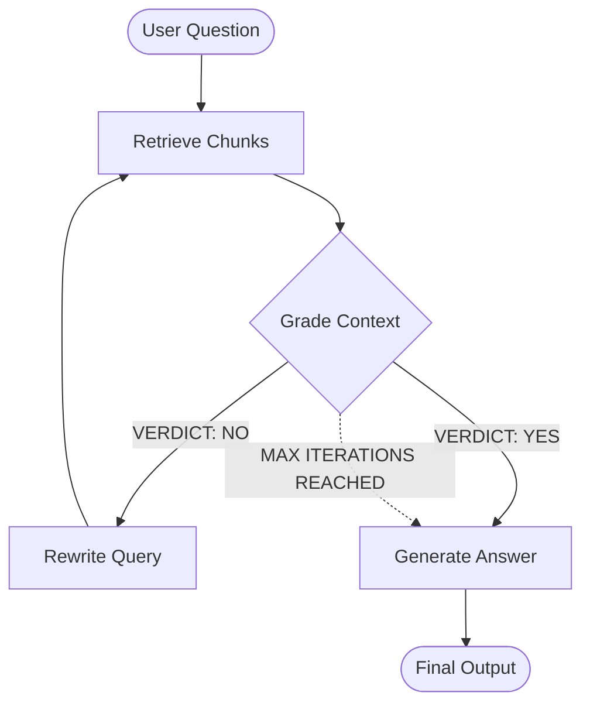
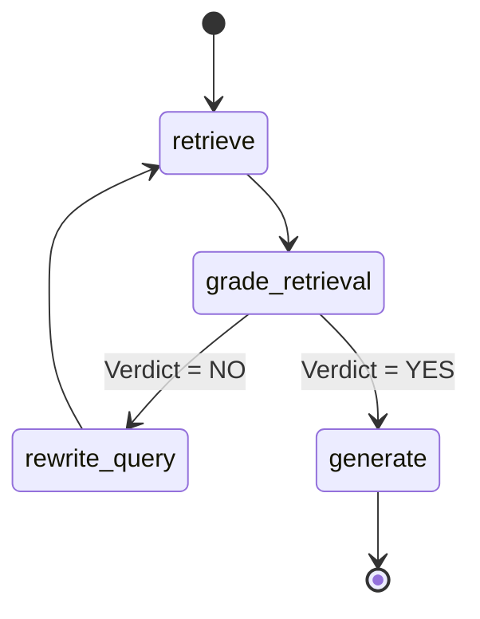

# 🔄 Self-Reflective Agentic RAG

## Project Overview
This project implements an advanced **Agentic Retrieval-Augmented Generation (RAG)** system designed to drastically reduce hallucinations and improve answer quality. Instead of blindly passing retrieved context to an LLM, this system employs an intelligent **Self-Reflection Loop** that evaluates, grades, and iteratively refines search queries until the retrieved context is both relevant and sufficient to answer the user's question.

## Problem Statement
Traditional RAG pipelines retrieve document chunks based on a single user query and immediately generate an answer. If the initial retrieval is poor, misses context, or lacks detail, the LLM often hallucinates or provides incomplete answers. There is no mechanism to recognize failure and try again.

## Key Features
- **Self-Reflective Retrieval:** An LLM acts as a strict judge, grading retrieved chunks on Relevance, Sufficiency, and Consistency.
- **Query Rewriting:** If context fails the grading, the system automatically rewrites a better, more specific search query and tries again.
- **Stateful Workflow:** Built with **LangGraph** to manage complex, cyclic agentic workflows.
- **Interactive UI:** A clean, easy-to-use **Gradio** interface that visually displays the inner "thought process" and reflection logs of the agent.

## Architecture

### Overall Agent Workflow



### LangGraph State Machine



## Tech Stack

| Component | Technology | Purpose |
| --- | --- | --- |
| **Language Model** | Local Ollama (qwen3:8b) | Complex reasoning, grading context, and generating the final answer. |
| **Embeddings** | nomic-embed-text (Ollama) | Converting text chunks into vector embeddings. |
| **Vector Database** | ChromaDB | Local, persistent storage for document vectors. |
| **Orchestration** | LangGraph | Managing the cyclic agent state and conditional routing. |
| **Document Processing**| LangChain | Loading, splitting, and processing PDFs. |
| **Frontend UI** | Gradio | Creating the interactive web interface. |

## Project Structure

```text
agentic_rag_system/
│
├── src/
│   ├── __init__.py           # Package marker
│   ├── config.py             # Global configurations & API handling
│   ├── state.py              # LangGraph state schema definition
│   ├── document_processor.py # PDF ingestion, chunking, and ChromaDB logic
│   ├── nodes.py              # Core LangGraph agent nodes (retrieve, grade, rewrite, generate)
│   ├── graph.py              # Workflow orchestration and conditional routing
│   └── ui.py                 # Gradio frontend application
│
├── chroma_db/                # Local Vector Store (auto-generated)
├── requirements.txt          # Python dependencies
├── .env.example              # Environment variables template
├── .gitignore                # Git ignore rules
├── run.py                    # Main entry point to start the app
└── README.md                 # Project documentation
```

## Component Responsibilities
1. **`document_processor.py`**: Handles loading PDFs, splitting them into overlapping chunks (1000 characters, 200 overlap), and storing them in ChromaDB.
2. **`state.py`**: Defines `GraphState`, the shared memory object passed between all nodes in the graph (tracking iterations, reflection logs, and refined queries).
3. **`nodes.py`**: The "brains" of the system. Contains the `retrieve`, `grade_retrieval`, `rewrite_query`, and `generate` functions.
4. **`graph.py`**: Wires the nodes together into a LangGraph `StateGraph`, defining the edges and conditional routing logic.
5. **`ui.py`**: Connects the LangGraph backend to a user-friendly Gradio web interface.

## Step-by-Step Execution Flow
1. **Ingestion**: User uploads a PDF. The system chunks and embeds it into ChromaDB.
2. **Querying**: User asks a question. The initial query is sent to the graph.
3. **Retrieval**: System fetches the top 4 most relevant chunks from ChromaDB.
4. **Grading**: The LLM evaluates the chunks against the question.
5. **Decision**:
   - If graded `YES`: The chunks are passed to the generator.
   - If graded `NO`: The LLM provides a refined query, and the system loops back to **Retrieval**.
6. **Generation**: The LLM formulates a final answer grounded strictly in the validated context.

## Installation

1. **Clone the repository:**
   ```bash
   git clone https://github.com/Hetgandhi25/agentic-rag-system.git
   cd agentic-rag-system
   ```

2. **Create a virtual environment:**
   ```bash
   python -m venv venv
   source venv/bin/activate  # On Windows: venv\Scripts\activate
   ```

3. **Install dependencies:**
   ```bash
   pip install -r requirements.txt
   ```

## Environment Variables
Create a `.env` file in the root directory (use `.env.example` as a template) and configure your local Ollama endpoints:

```env
OLLAMA_BASE_URL=http://localhost:11434
OLLAMA_MODEL=qwen3:8b
EMBEDDING_MODEL=nomic-embed-text
MAX_ITERATIONS=3
```

## How to Run
Start the application by running the entry point script:

```bash
python run.py
```
This will launch a local server. Open the provided URL (typically `http://127.0.0.1:7860`) in your browser.

## Traditional RAG vs Agentic RAG

| Feature | Traditional RAG | Agentic RAG |
| --- | --- | --- |
| **Flow** | Linear (Retrieve -> Generate) | Cyclic (Retrieve <-> Grade -> Generate) |
| **Query Refinement** | None. Fails if user query is poor. | Active. Rewrites query if initial results are bad. |
| **Hallucination Risk** | High. Tries to answer even with bad context. | Low. Explicitly blocks generation until context is validated. |
| **Complexity** | Low. Easy to build. | High. Requires state management (LangGraph). |

## Limitations
- **Latency**: Due to the iterative reflection loop, time-to-first-token (TTFT) is higher than traditional RAG.
- **Cost**: Multiple LLM calls for grading and query rewriting increase API token usage.
- **Context Window**: Highly dependent on the chosen chunk size and the LLM's context limit.

## Future Improvements
- **Multi-Document Support**: Expand the UI and processor to handle multiple PDFs simultaneously.
- **Hybrid Search**: Combine vector search with keyword search (e.g., BM25) for better retrieval.
- **Streaming Output**: Stream the final answer to the UI for better perceived performance.
- **Web Search Fallback**: If the document lacks the answer, use a tool to search the web as a fallback.

## Interview Explanation
> *"This project demonstrates my ability to move beyond basic LangChain chains and build stateful, agentic workflows using LangGraph. I recognized that traditional RAG systems suffer from high hallucination rates when retrieval fails. To solve this, I designed a self-reflective loop where the LLM acts as an autonomous agent—grading its own retrieval and rewriting queries dynamically. By structuring the code into distinct modules (state, nodes, graph, UI), I ensured the system is scalable, testable, and production-ready."*
